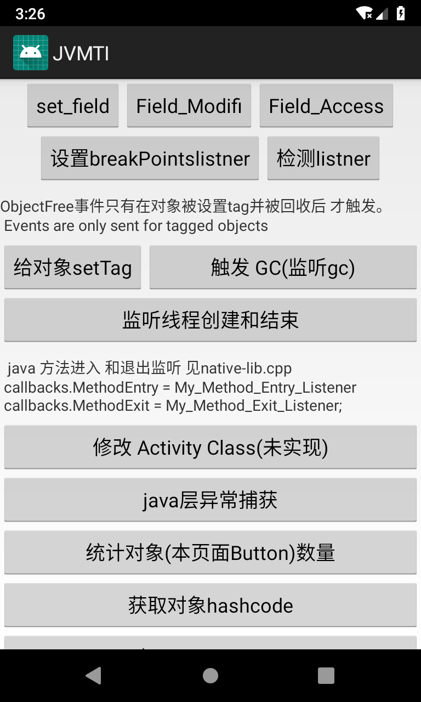

# JVMTI_Sample

该例子主要展示了JVM TI支持的几种功能：

1. JNI Method Rebind
2. Class Retransform
    利用dex字节码操作库 dexer, 向Activity 的 onCreate 方法中插入一行代码。

3. Activity对象泄露监控，并找到gc root 到activity 对象的引用链。
    这里使用了如下开源库来 获取和分析对象引用关系，但是在输出引用链信息时，输出的不是引用字段信息。而是字段的索引，需要
    进一步计算出字段 。经过看文档和查找解决方案，  最终无法根据输出的索引计算出 引用activity的 Field . 目前搁置中。
    https://github.com/JetBrains/debugger-memory-agent

4. 一些jvmti 函数的调用练习。例如
    统计对象数量，
    获取对象hashcode

5. 一些jvmti 定义的事件监听练习。例如
    字段访问，修改监听
    给java方法设置breakpoint 后，触发breakpoint 的监听
    给某个对象设置Tag,对象回收后的监听
    线程的创建和结束 的 监听
    Java方法被执行和执行结束监听


注意：例子最好在9.0上测试，支持模拟器，8.0下修改 Class 功能无效

运行界面
======



产生的日志可以在 Logcat 中查看

```
I/jvmti: ==========alloc callback======= [I {size:32}
I/jvmti: ==========alloc callback======= java.lang.ref.WeakReference {size:24}
I/jvmti: ==========alloc callback======= java.lang.ref.WeakReference {size:24}
I/jvmti: ==========alloc callback======= [Ljava.lang.Object; {size:16}
I/jvmti: ==========触发 GCStart=======
I/jvmti: ==========触发 GCFinish=======
```